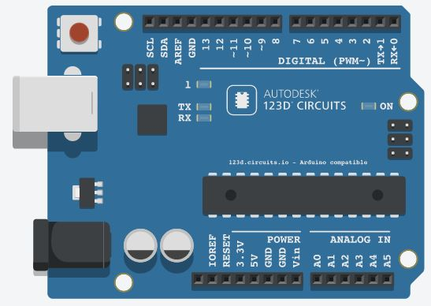

#Digital y Analógico (Orientado a Arduino)

Lo digital puede ser comprendido como 1's y 0's, encendido y apagado. Pero, ¿cómo hace el Arduino para determinar si está leyendo un "1" o un "0"? Lo que hace en realidad es leer el voltaje en el pin deseado, y si el valor es mayor a cierto punto, lo considera como "1"(**HIGH**), y si es menor, lo considera como "0"(**LOW**). Puesto que el mundo del Arduino está comprendido entre los 0 y 5V, si le otorgamos un valor cercano a 5V lo considerará como alto, y si le otorgamos un valor cercano a 0V lo considerará como bajo. El valor umbral está cercano a los 2V, pero para no causar confusiones en la lectura digital, se recomienda que el voltaje entregado no esté cerca al valor mencionado, ya que podría generar datos erróneos.

Lo analógico se comprende como variación. Es decir, el Arduino lee el pin seleccionado y almacena el valor de voltaje con un número entre 0 y 1023, escalando los valores de 0V a 5V. Para esto, 0V equivale a 0 y 5V a 1023, y cualquier valor intermedio se puede calcular por una regla de tres simple.

Ambos casos se podrían ilustrar con una escalera. Mientras que a la lectura digital solo almacena si estás abajo o estás arriba (verdadero o falso), la lectura analógica almacena en qué escalón estás (variación).

Pasemos al hardware entonces. El arduino tiene 13 pines digitales, pero puesto que los dos primeros son utilizados para la comunicación serial, normalmente no se usan, así que los pines digitales 0 y 1 no serán usados de momento.
Estos pines pueden ser configurados como entradas, o como salidas.

Luego están los pines analógicos, del A0 al A5. Estos sólo pueden ser usados como entradas.

