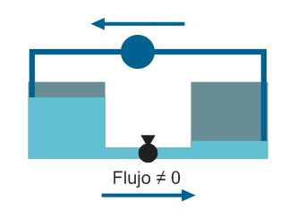

#Fundamentos de la electrónica
Antes que nada, quisiera compartir con ustedes cierta frase que me ha estado acompañando desde hace ya bastante tiempo:  
>"Me lo contaron y lo olvidé, lo vi y lo aprendí, lo hice y lo entendí."

Dicho esto, bienvenidos a esta sección del entrenamiento, en la que nos enfocaremos en la electrónica. Así que daremos un vistazo realmente rápido a la evolución que ha tenido esta rama.

####Contenido
#####Breve (realmente breve) resumen de la historia de la electrónica  
#####Conceptos básicos
#####Arduino (introducción)

***Érase una vez***

Ya desde los años **1800** con la invención de la **pila voltaica** (cortesía de Alessandro Volta), empezaron los avances en este campo. Otros grandes avances, hoy obsoletos y ligeramente olvidados, fueron el diodo al vacío (**1904, Fleming**), el primer dispositivo rectificador de corriente; y el triodo (**1906, Lee**), el primer componente amplificador electrónico. Sin embargo, todo dio un salto enorme desde la invención del **transistor**, en **1947**. Esto redujo enormemente el espacio y los recursos necesarios para implementar un circuito.

El desarrollo de los semiconductores pronto permitiría que en un solo chip puedan entrar 6 transistores dando nacimiento al primer **circuito integrado**, en **1958**. Luego, en **1970** se desarrolló el primer **microprocesador**. Años después, la eletrónica ha dejado (en gran parte) de ser una ciencia solo para aplicaciones industriales, para convertirse en parte de lo cotidiano. Poseemos celulares, radios, computadoras y un sinfín de equipos que consideramos parte de nuestras vidas. 

Si bien la intención de este entrenamiento no es desarrollar cosas con tal magnitud de complejidad, deseamos que obtengan las herramientas básicas para prototipar circuitos, pierdan el miedo a lo desconocido y puedan realizar los proyectos que necesiten, desde el ámbito universitario hasta la domótica.

***Empecemos entonces***

Primero daremos una breve explicación de los conceptos básicos necesarios.   

El voltaje, o diferencia de potencial, puede ser asimilado como la diferencia de nivel entre dos tanques conectados.

Si no hay diferencia de nivel, no puede haber flujo. Lo mismo ocurre con la corriente. Si no hay diferencia de potencial, no hay corriente. Sin embargo, hay otro requisito, y es que el flujo sea permitido por las conexiones entre los tanques. Es decir, mientras nadie le permita el paso, a pesar de tener voltaje, la corriente será 0.

Ahora bien, contamos con una diferencia de potencial estable. Para que esto ocurra, usamos una fuente de voltaje, que puede ser asemejada a una bomba de agua que mantiene la diferencia de nivel, permitiendo un flujo constante por diferencia de potencial.

Sin embargo, la cantidad de agua que circula depende de la tubería. Mientras más angosta sea, menos agua podrá circular. Esto se asemeja a las resistencias, que limitan el flujo de la corriente.

Es hora de ponerle unidades. La **diferencia de potencial** (diferencia de nivel) se mide en **voltios (V)**; la **intensidad de corriente** (flujo de agua), en **amperios (A)** y la **resistencia** (el ancho de la tubería), en **ohmios (Ω)**.   
La relación entre las variables anteriormente mencionadas es descrita por la famosa ley de Ohm:

> Voltaje = Corriente x Resistencia

>V = I X R

Puesto que un amperio es una unidad bastante grande de corriente, lo normal es trabajar con el **miliamperio (mA)**

Realizaremos el cálculo correspondiente para el siguiente circuito:

